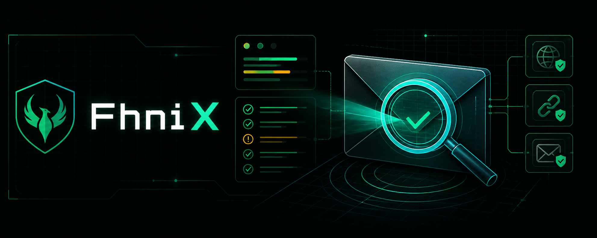
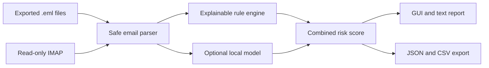
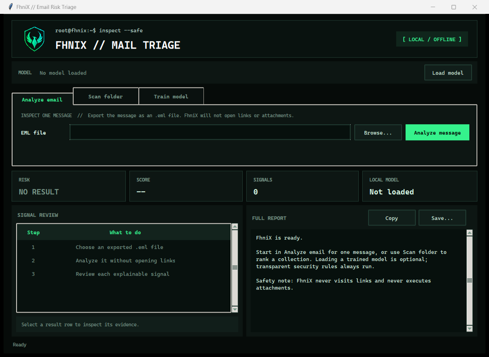

<p align="center">
  
</p>

<h1 align="center">FhniX</h1>

<p align="center">
  
</p>

<p align="center">
  Explainable, local-first phishing triage for exported emails and read-only IMAP mailbox scans.
</p>

<p align="center">
  
  
  
  
</p>

FhniX helps analysts, blue teams, students, and everyday users inspect suspicious emails without opening links or executing attachments. It combines transparent detection rules with an optional locally trained Naive Bayes model and explains the signals behind every result.

> [!IMPORTANT]
> FhniX is a defensive triage aid, not a final security verdict. Verify unexpected requests through a trusted, independent channel before taking action.

## Why FhniX?

| Capability | What it provides |
| --- | --- |
| Explainable analysis | Every warning includes a rule, severity, score contribution, and evidence. |
| Safe inspection | URLs are defanged in reports; links are not visited and attachments are not executed. |
| Local-first workflow | `.eml` analysis, model training, and inference stay on your machine. |
| Flexible input | Analyze one email, scan folders recursively, or fetch recent messages through read-only IMAP. |
| Useful output | Review results in the GUI or export text, JSON, and Excel-friendly CSV reports. |
| Hybrid detection | Combine deterministic security rules with an optional model trained on your own labeled data. |

## What It Detects

- `From`, `Reply-To`, and `Return-Path` mismatches, duplicate sender headers, and Unicode control characters
- SPF, DKIM, and DMARC failures recorded in email headers
- urgent language, credential requests, financial pressure, and social-engineering wording in English and Turkish
- raw-IP, shortened, redirected, misleading, lookalike, Punycode, risky-TLD, user-info, and non-standard-port URLs
- sender, brand, visible-link, and destination-domain inconsistencies
- executable, macro-enabled, archive, active-content, double-extension, and deceptive-name attachments
- embedded forms, password fields, hidden HTML, HTML-only messages, and QR-code lures
- patterns learned from locally labeled phishing and legitimate emails

## How It Works



FhniX never visits extracted links or runs attachment content. Mailbox mode is only activated when you explicitly request it.

## Requirements

- Python 3.11 or newer
- Windows, macOS, or Linux
- Tk support when using the desktop GUI
- No third-party runtime dependencies for the core application

## Installation

```powershell
git clone https://github.com/dRafaleD/FhniX.git
cd FhniX
py -m pip install -e .
fhnix --version
```

Use `python` instead of `py` on systems where the Python launcher is unavailable. The legacy `phishlens` command remains available for compatibility.

## Quick Start

Analyze an exported email:

```powershell
fhnix analyze "C:\Users\you\Desktop\suspicious.eml"
```

Launch the terminal-style desktop interface:

```powershell
fhnix gui
```

You can also use the short form:

```powershell
fhnix "C:\Users\you\Desktop\suspicious.eml"
```

The GUI supports single-message analysis, folder scans, model loading, local training, evidence inspection, report saving, and CSV export.

## Desktop Interface

<p align="center">
  
</p>

## Folder Scans and Reports

Scan all `.eml` files in a folder:

```powershell
fhnix scan "C:\Users\you\Desktop\mail-samples"
```

Include subfolders and save a readable report:

```powershell
fhnix scan "C:\Users\you\Desktop\mail-samples" --recursive --output folder-report.txt
```

Save machine-readable JSON:

```powershell
fhnix scan "C:\Users\you\Desktop\mail-samples" --recursive --json --output folder-report.json
```

The command returns exit code `1` when at least one message is high-risk, making it useful in scripts and simple CI checks. Exit code `2` means an operational error occurred.

## Train a Local Model

Training is supervised. Place correctly labeled `.eml` files into this structure:

```text
training-data/
|-- phishing/
|   |-- known-phish-001.eml
|   `-- known-phish-002.eml
`-- legitimate/
    |-- normal-mail-001.eml
    `-- normal-mail-002.eml
```

Train and use the model:

```powershell
fhnix train training-data --output fhnix-model.json
fhnix analyze suspicious.eml --model fhnix-model.json
fhnix scan mail-samples --recursive --model fhnix-model.json
```

The included example data only demonstrates the workflow. For a meaningful evaluation, use varied and accurately labeled messages, keep classes reasonably balanced, remove duplicates, and reserve a separate final test set.

## Mailbox Mode

Mailbox scans use TLS, open the selected folder read-only, and fetch messages with `BODY.PEEK[]` so they are not marked as read. Secrets are read from environment variables rather than command-line arguments.

Gmail with an app password:

```powershell
$env:FHNIX_IMAP_USERNAME = "you@gmail.com"
$env:FHNIX_IMAP_PASSWORD = "your-app-password"
fhnix mailbox --provider gmail --auth password --limit 10 --unread-only
Remove-Item Env:FHNIX_IMAP_PASSWORD
```

Outlook with a short-lived OAuth2 token:

```powershell
$env:FHNIX_IMAP_USERNAME = "you@outlook.com"
$env:FHNIX_OAUTH_TOKEN = "your-access-token"
fhnix mailbox --provider outlook --auth oauth2 --limit 10 --unread-only
Remove-Item Env:FHNIX_OAUTH_TOKEN
```

Provider application registration and token refresh are not automated yet. Never commit credentials, private emails, training datasets, or personal model files.

## Scoring

The rule engine produces an explainable heuristic score from 0 to 100. Without a model, that is the final score. When a model recognizes enough features and predicts phishing with sufficient confidence, FhniX blends the model signal with the heuristic score. The model cannot suppress a rule-based warning.

| Score | Verdict | Recommended response |
| ---: | --- | --- |
| `0-19` | `low-risk` | Continue carefully; no automated result guarantees safety. |
| `20-49` | `suspicious` | Verify the sender and destination independently. |
| `50-100` | `high-risk` | Do not interact; verify through a known contact channel. |

## Platform Notes

- **Windows:** Standard Python installations include Tk. FhniX has no compiled runtime dependency, so a Visual Studio `link.exe` toolchain is not required.
- **Ubuntu/Debian:** Install Tk with `sudo apt install python3-tk` if the GUI does not start.
- **Fedora:** Install Tk with `sudo dnf install python3-tkinter` if needed.
- **macOS:** Python from python.org normally includes Tk. Homebrew users may need `brew install python-tk` for their Python version.
- **Headless systems:** Use the CLI commands; the GUI requires a graphical desktop session.

## Development

Run the test suite from the repository root:

```powershell
$env:PYTHONPATH = "src"
py -m unittest discover -s tests -v
```

The codebase uses a `src/` layout and keeps its core implementation dependency-free. Contributions should include focused tests and must not send email content to external services.

## Security

Please do not publish vulnerabilities or sensitive sample emails in public issues. Read [SECURITY.md](SECURITY.md) for the supported version and responsible disclosure process.

## Project Status

FhniX is an early-stage defensive security project. Rules can produce false positives and may miss novel attacks. Treat every result as an investigation lead and keep human verification in the loop.

## License

Released under the [MIT License](LICENSE).
